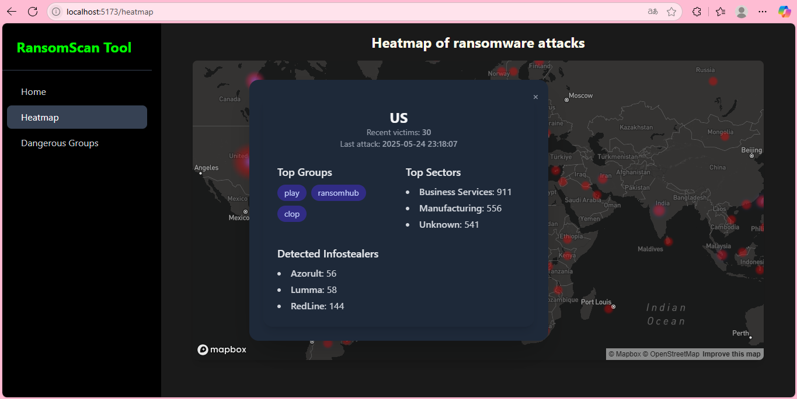

# 🚀 Ransomware Live Tracker


## 📚 Table of Contents

- [Description](#description)
- [Features](#features)
- [Installation](#installation)
- [How to use the App](#how-to-use-the-app)
- [How the data was processed](#how-the-data-was-processed)


## Description
Track and visualize ransomware attacks in real time across the globe, integrating open data and interactive maps to identify patterns and the most dangerous groups.


## Features
- 🌍 Interactive Map with Ransomware Attacks info
- 📡 Real-Time API Integration
- 🧠 Analysis of Groups and Attack Tactics


## Installation

#### Prerequisites: You need to have Python > 3.9, Node.js v20 and Git installed on your computer.

Clone repo:
```bash
git clone https://github.com/AVR216/ransomware-attacks-tool.git
```  


### 🔧 Backend (Python + Flask)

```bash
cd ransomware-attacks-tool/api-hacker-simulation
```

1. Create a virtual environment (Linux)
```bash
python3 -m venv venv
source venv/bin/activate
```

If you have Windows
```bash
python3 -m venv venv
.\venv\Scripts\activate
```

2. Install dependencies
```bash
pip install -r requirements.txt
```

3. Environment variables: You must create .env file and set the 
following:

```bash
PORT=5002
CONTEXT_PATH=/api/v1
ALLOWED_DOMAINS=*
RANSOMWARE_API_PROTOCOL=https
RANSOMWARE_BASE_URL=api.ransomware.live/v2
API_USAGE_LIMIT=200
```

4. Run project
```bash
python3 run.py
```

### ⚛️ Frontend (React + Vite + TS) - with bun

```bash
cd ransomware-attacks-tool/ransomware-attacks-viewer
``` 

1. Install dependencies:
```bash
bun install
```

2. Environment variables: You must create .env.local file and set the 
following:
```bash
VITE_MAPBOX_TOKEN={MAPBOX_API_KEY}
VITE_API_BASE_URL=http://localhost:{BACKEND_PORT}/api/v1/ransomware
```
Given the context of the test and the fact that creating a Mapbox account just to request an API key might be inconvenient, I'm sharing mine with you. (It will only be active for a few days):

```bash
pk.eyJ1IjoiYXZyMjE2IiwiYSI6ImNtYjA4c2pwdDByZWkya29wZXRiczI2NWMifQ.WXExsenqK2KCdhX60ERqJQ
```

3. Run project:
```bash
bun run dev
```

Note: Sometimes you may need to install Bun. You can do it (on Linux, Windows or Mac) with the following command:
```bash
curl -fsSL https://bun.sh/install | bash
bun --version
```


## How to use the app

The application provides an experience where your mission is to analyze the information it presents through its two main modules: Heatmap and Dangerous Groups.

1. To get started, open your browser and type the following into the address bar:
```bash
localhost:5173
```

2. Once the site loads, you'll find your mission details on the /home page.


3. After reading the mission, you can navigate to the Heatmap section. There, you'll see a world map displaying relevant information about ransomware attacks in each country.


4. If you click on any point in any country, a modal will appear showing additional information about that country.




5. In the Dangerous Groups section, you'll find a table where you can filter the content based on the risk level of each group, as well as a top ranking of the most dangerous ones.


## How the data was processed
First, the documentation of the ransomware API was reviewed to identify which endpoints were useful to achieve the goal. After analyzing the responses from these endpoints, it was found that some returned a large amount of data. Therefore, a caching strategy using JSON files was implemented to make these time-consuming requests only once—each time the update date from the ransomware API changed.